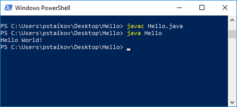

# Въведение в Java

## Презентации
[Въведение и подготовка за класа](https://docs.google.com/presentation/d/1QPvrKR3p7uFKQXmBtre9A2wkvuNvV8J9RP7oRTAnFsc/edit?usp=sharing)

## Видео
[Intro 1 13.07.2020](https://youtu.be/xi8PJHHTxWA)

## Упражнения

### Упр. 1
Свалете файла [Hello.java](../Hello.java). Забележете папката, в която сте го поставили. Отворете команден прозорец в тази папка. И напишете следните две команди в прозореца:
~~~
	javac Hello.java
	java Hello
~~~
Резултатът трябва да изглежда долу-горе така:


### Упр. 2
Променете програмата, която печата “Hello World!” така, че да отпечатва “Hello Java!”. 

### Упр. 3
Напишете програма, която да отпечата колонка с числата от 1 до 10. 

### Упр. 4
Напишете програма, която да отпечата триъгълник, състоящ се от десет реда със звездички, който да изглежда така:

~~~
*
**
***
****
*****
******
*******
********
*********
**********
~~~

### Упр. 5
Какво ще изпринтят следните линии на екрана? Помислете малко, направете предположение, след това напишете програма, която изпълнява този код и проверете предположенията си.
~~~
System.out.println("\"Quotes\"");
System.out.println("Slashes \\//");
System.out.println("How '\"confounding' \"\\\" it is!");
~~~

### Упр. 6
Напишете програма с име WellFormed, която да изпринти следните линии:
~~~
A well-formed Java program has
a main method with { and }
braces.

A System.out.println statement
has ( and ) and usually a
String that starts and ends
with a " character.
(But we type \" instead!)
~~~

### Упр. 7
Следната програма има десетина грешки. Копирайте в IntelliJ, коригирайте и изпълнете програмата.
~~~
public class LotsOf Errors {
    public static main(String args) {
        System.println(Hello, world!);
        message()
    }

    public static void message {
        System.out println("This program surely cannot ";
        System.out.println("have any "errors" in it");
    }
~~~

Очакван резултат:
~~~
Hello, world!
This program surely cannot 
have any "errors" in it
~~~

### Упр. 8
Проследете изпълнението на следния код и помислете какво ще се принтира на конзолата. След това изпълнете програмата и проверете предположението си.

```java
public class Tricky {
	public static void main(String[] args) {
		message1();
		message2();
		System.out.println("Done with main.");
	}

	public static void message1() {
		System.out.println("This is message1.");
	}

	public static void message2() {
		System.out.println("This is message2.");
		message1();
		System.out.println("Done with message2.");
	}
}
```

### Упр. 9
Проследете изпълнението на следния код и помислете какво ще се принтира на конзолата. След това изпълнете програмата и проверете предположението си.

```java
public class Strange {
	public static void main(String[] args) {
		first();
		third();
		second();
		third();
	}

	public static void first() {
		System.out.println("Inside first method.");
	}

	public static void second() {
		System.out.println("Inside second method.");
		first();
	}

	public static void third() {
		System.out.println("Inside third method.");
		first();
		second();
	}
}
```

