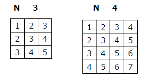

# WHILE Цикъл

## Презентации
* [While Цикъл](https://docs.google.com/presentation/d/1d4UXru-poFYmFsETzweIxN3CQWwbAexFo9d-MhXvARQ/edit?usp=sharing)

## Видео
* [While цикъл 1](https://drive.google.com/file/d/1_59UW4Z8SDfVM92od-rZOncsqy8ix8ap/view?usp=sharing)

## Упражнения

### Упр. 1
Да се напише програма, която приема цяло число n от потребителя и отпечатва числата от 1 до n, разделени със запетая. Например:
~~~
5
1,2,3,4,5
~~~
Забележете, че няма запетая преди 1 или след n.

### Упр. 2
Напишете програма, която да използва while loop и да отпечатва числа от едно до N. Сравнете я с аналогична програма, която използва for loop.

### Упр. 3
Да се напише програма, която чака да прочете число, което е валидна оценка от училище. Докато не прочете такава, програмата изписва съответно съобщение за грешка. Ако числото, което е въвел потребителят, е под 2 да изведе &quot;Invalid input.The number is less than 2.&quot;Ако потребителят е въвел число по-голямо от 6 да се извежда &quot;Invalid input.The number is bigger than 6.&quot; След като прочете валидната оценка програмата да изпише с думи значението на оценката (Excellent, Very good, Good, Fair, Fail)
<table>
<tr>
<th>Вход</th>
<th>Изход</th>
</tr>
<tr>
<td>0</td>
<td>Invalid input.The number is less than 2.</td>
</tr>
<tr>
<td>17</td>
<td>Invalid input.The number is bigger than 6.</td>
</tr>
<tr>
<td>5</td>
<td>Very good</td>
</tr>
</table>

### Упр. 4
Да се напише програма, която приема числа от потребителя, докато той въведе -1. Тогава програмата отпечатва сумата на въведените числа.

### Упр. 5
Напишете програма, която чете от конзолата поредица от цели числа и отпечатва най-малкото и най-голямото от тях.

### Упр. 6
Напишете програма, която чете от конзолата числото N и отпечатва сумата на първите N члена от редицата на Фибоначи: 0, 1, 1, 2, 3, 5, 8, 13, 21, 34, 55, 89, 144, 233, 377, ...

### Упр. 7
Напишете програма, която чете от конзолата положително цяло число N (N < 20) и отпечатва матрица с числа като на фигурата по-долу:

