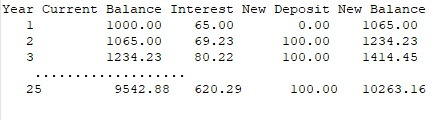

# Задачи с цикли

## Видео
* [Задачи с цикли](https://drive.google.com/file/d/121IcKsmfkYoxts0ZuQJlV46Oz4NPUAAJ/view?usp=sharing)

## Упражнения

### Упр. 1
Напишете програма, която пресмята N на степен M, за дадени две цели числа N и М. Проверете верността на резултата, като също отпечатате Math.pow(N, M).

### Упр. 2
Напишете програма, която при въведено цяло положително число N, пресмята неговия факториел N! = 1.2.3...(N-1)N. Например, 3! = 1.2.3 = 6, 4!=1.2.3.4 = 24 и т.н.

### Упр. 3
Напишете програма, която пресмята N!/K! за дадени N и K (1<K<N).

### Упр. 4
Напишете програма, която пресмята на колко нули завършва факториела на дадено число. Примери:
~~~
N = 10 -> N! = 3628800 -> 2
N = 20 -> N! = 2432902008176640000 -> 4
~~~

### Упр. 5
Напишете програма, която по дадени две цели числа M и N, отпечатва случайно цяло число в интервала [M,N].

### Упр. 6
Напишете програма, която по дадени две числа M и N, отпечатва случайно дробно число в интервала [M,N).

### Упр. 7
Напишете програма, която проверява дали дадено цяло число N е просто. Прости са тези числа, които се делят без остатък само на едно и на себе си.

Подсказка: На пръв поглед изглежда, че трябва да проверим дали числото се дели на всички цели числа в интервала (1, N). Всъщност, оказва се, че трябва само да проверим дали N се дели на числата в интервала (1, &radic;N&#773;)

### Упр. 8
Напишете програма, която при дадено цяло положително число N, отпечатва всички прости числа в интервала [1,N].

### Упр. 9
 Банка предлага лихва 6,5% на спестовни влогове, която се изчислява годишно. Създай таблица, която показва колко пари ще се съберат за период от 25 години, ако първоначалният влог е 1000 лв и всяка следваща година се депозират нови 100 лв. Таблицата трябва да включва за всяка година досегашния баланс, лихвата, новия депозит и новия баланс. Отпечатаното от програмата трябва да изглежда така:
 