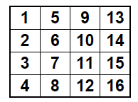

# Масиви от данни (Arrays)

## Презентации
[Масиви от данни](https://docs.google.com/presentation/d/12qVn3-j-jkhg2LxahA9mZbjkzQAdGVjJY6qmFHmyucc/edit?usp=sharing)

## Видео
* [Arrays](https://drive.google.com/file/d/1MPBZwWlejF5lb_1L21aIxzIyDRkUCXGz/view?usp=sharing)
* [Arrays 1](https://drive.google.com/file/d/1t4Jv-yIkxkFIOxbrACMS_YaDmj-ICPJm/view?usp=sharing)

## Упражнения

### Упр. 1
Да се напише програма, която първо приема цяло n число за броя на последващите данни. След това потребителят въвежда температурата за определения брой дни. Програмата изчислява средната температура и отпечатва броят на дните, в които температурата е била по-висока от средната. 

### Упр. 2
Да се напише метод със следната сигнатура:
~~~
public static void swap(int[] a, int i, int j)
~~~ 
Методът приема като параметър масивът а и двата индекса i и j. След това сменя местата на елементите с тези индекси.
Например, ако извикаме метода така:
~~~
int a = [0, 1, 2, 3];
swap(a, 1, 2);
~~~
след изпълнението му, съдържанието на а ще бъде:
[0,2,1,3]

### Упр. 3
Да се напише метод,
~~~
public static int[] reverseCopy(int[] a)
~~~
 който приема масив като параметър, и връща нов масив, в който елементите на масива от входа са в обратен ред. Например, ако подадем на входа [1, 2, 3, 4], върнатият резултат ще бъде [4, 3, 2, 1].

### Упр. 4
Да се напише метод,
 ~~~
 public static void reverse(int[] a), 
~~~
който преобръща реда на елементите на масив. Например, ако подадем следния масив като входен параметър: [1, 2, 3, 4], елементите на същият масив, след изпълнението на метода ще бъдат: [4, 3, 2, 1].

### Упр. 5
Да се напише програма, която създава масив с 20 елемента от целочислен тип и инициализира всеки от елементите със стойност равна на индекса на елемента умножен по 5. Елементите на масива да се изведат на конзолата.

### Упр. 6
Да се напише метод, който приема два масива на входа и проверява дали са еднакви.

### Упр. 7
Да се напише метод, който да приема масив от цели стойности и да връща средната стойност на елементите от масива. 

### Упр. 8
Да се напише метод, който приема масив като входен параметър и връща нов масив, в който всеки елемент се среща два пъти. Например ако входът е [1, 4, 0, 7], на изхода ще се получи [1, 1, 4, 4, 0, 0, 7, 7]

### Упр. 9
Да се напише метод,
~~~
public static int[] merge(int[] a1, int[] a2)
~~~
който приема два масива и произвежда нов, който съдържа елемнтите и на двата.

### Упр. 10
Да се напише метод,
~~~
public static int[] merge3(int[] a1, int[] a2,  int[] a3)
~~~
който приема три масива и произвежда нов, който съдържа елементите и на трите. Можем ли да използваме методът merge(a1, a2) от предната задача, за да улесним работата си?

### Упр. 11
Напишете метод, 
~~~
public static int[] randomArray(int size, int min, int max)
~~~
който създава и връща масив с даден размер, изпълнен със случайни цели числа в даденият интервал [min, max].

### Упр. 12
Напишете метод, 
~~~
public static void shuffle(int[] arr)
~~~
който разбърква масив, така че след изпълнението му масивът да има същите елементи, но подредени в различен, случайно избран ред.

### Упр. 13
Напишете програма, която да създава и отпечатва масив от String с наименованията на 52 карти за игра. Името на картите трябва да включва: цвят (Club, Diamond, Heart, Spade ), и вида на картата (2,3,4,5,6,7,8,9,10,J,Q,K,A).

### Упр. 14*
Напиши метод mostFrequentDigit, който да връща най-често срещаната цифра в дадено число. Например,
~~~
mostFrequentDigit(669260267);
~~~
ще върне 6.

Подсказка: Създай масив с десет елемента за цифрите от 0 до 9. Започни да получаваш цифрите на подаденото число една по една като делиш на 10 и за всяка получена цифра, увеличавай съответната стойност в масива с едно. Накрая, индексът на клетката с най-голяма стойност, ще е търсената, най-често срещана цифра. Ако има две или повече цифри, които се срещат най-често, върни най-малката.

### Упр. 15*
Простите числа играят много важна роля в криптографията. Най-широкоизползвания метод за намиране на прости числа е така нареченото решето на Ератостен. Потърсете информация на интернета какво представлява този алгоритъм и се опитайте да го реализирате.

### Упр. 16
Напишете програма, която да приема от потребителя стойностите на двумерен масив с размер 3х2. След това, програмата отпечатва масива на конзолата по два начина: първо по една редица от масива на ред, а след това използвайки метода Arrays.deepToString().

### Упр. 17
Напишете метод, който намира максималната площадка в матрица. Максималната площадка е тази подматрица с размер 2х2, която има максимална сума на елементите. Трябва да се отпечатат индексите на първият елемент на максималната площадка, както и сумата на елементите и. Например, ако на входа се подаде матрицата
~~~
int[][] matrix = {
    { 0, 0, 0, 0 },
    { 0, 1, 1, 0 },
    { 0, 1, 1, 0 },
};
~~~
Тогава програмата ще отпечата:
~~~
Indeces: 1, 1
Value:   4
~~~

### Упр. 18
Напишете програма, която създава следната квадратна матрица и я извежда на конзолата във форматиран вид. Размерът на матрицата се въвежда от конзолата. Пример за (4,4):

